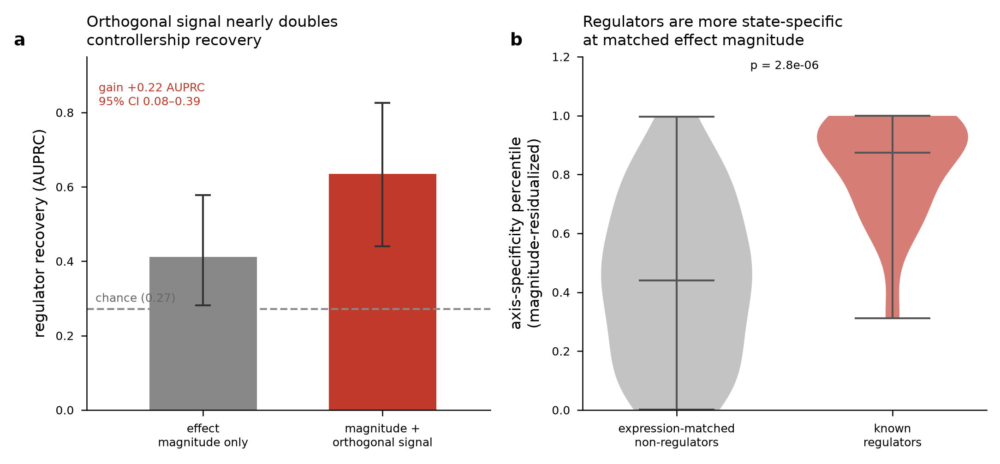
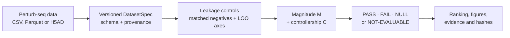

# T-CTRL — Which genes actually steer T-cell state?

**T-CTRL** is the judge-facing experience. **ISCI (Immune-State Controllability Index)** is the
open-source, auditable method behind it.

Most perturbation screens reward genes that cause the biggest change. T-CTRL asks a harder
question: **among perturbations with a similar effect size, which genes move a T cell toward a
specific functional state and repeat that behavior across donors?**

The output is not a therapeutic-target list. It is a bounded scientific verdict — **PASS, FAIL,
NULL or NOT-EVALUABLE** — with the evidence and provenance needed to audit it.

> **Built with Claude: Life Sciences · Researcher Track · MIT open source**
>
> Genome-scale Perturb-seq in primary human CD4+ T cells · CPU-local on a 24 GB Mac · no raw
> clinical or large H5AD/H5MU data committed

## Start here

This is a reusable public research project with a short evaluation path for the hackathon. Choose
the route that matches what you want to do:

| For | Time | Start here | What you will get |
|---|---:|---|---|
| **Hackathon judges** | **3 min** | [Open the interactive overview](https://anetoc.github.io/ISCI-hackathon/) | The scientific question, result, failed tests, reusable workflow and next experiment in six scenes |
| **New readers** | **5 min** | [Read the plain-language package map](DELIVERABLE.md) | What was built, what is real today and what is deliberately not claimed |
| **Researchers** | **10 min** | [Review the executed notebook](notebooks/ISCI_Researcher_Track_Walkthrough.ipynb) | The result, falsification tests, Claude correction loop and reusable framework |
| **Bring your own data** | **15 min** | [Run the DatasetSpec workflow](#run-t-ctrl-on-another-perturb-seq-dataset) | Validate, inspect and analyze a compatible Perturb-seq dataset through the same bounded pipeline |
| **Scientific reviewers** | **Deep dive** | [Audit the claim ledger](reports/CLAIM_LEDGER.md) and [result provenance](outputs/hackathon/readiness_report.json) | Claim status, evidence, limitations, hashes and explicit overclaim boundaries |

The shortest complete judge route is the [interactive overview](https://anetoc.github.io/ISCI-hackathon/),
the [evidence-based slide deck](outputs/tctrl_hackathon_deck.pptx) and the
[executed notebook](notebooks/ISCI_Researcher_Track_Walkthrough.ipynb). The committed
[2:30 Full-HD MP4](demo_assets/hackathon/hackathon_fallback_2m30.mp4) is a deterministic offline
visual fallback for presentation continuity. It is not the final orientation video: the public
submission recording must include reviewed narration and pass the repository's media validator.

## The result

> **Among detectable-effect, canonical T-cell-state regulators, axis-specificity and cross-donor
> coherence add information beyond perturbation magnitude.**

In the authoritative pre-specified test, adding controllership features to magnitude improves
AUPRC by **+0.357** (0.539→0.896; 95% CI +0.117 to +0.538). When every learnable step is refit out
of fold, the conservative gain remains **+0.215** (95% CI +0.074 to +0.560; permutation p=0.010).



The project reports four related estimands because they answer different questions; it never
silently swaps one for another:

| Estimand | Result | Role |
|---|---:|---|
| Pre-specified full-sample M→M+C | **+0.357 AUPRC** | Authoritative test of added value over magnitude |
| Fully refit, leakage-free OOF | **+0.215 AUPRC** | Conservative generalization estimate |
| Simple ranking-quality view | **0.415→0.722 AUPRC** | Descriptive score comparison on the detectable set |
| Three-condition matched C-vs-M | **+0.229 [0.072, 0.405]** | Standardized cross-system comparator |

The hierarchy and exact wording are frozen in [reports/result_lock.md](reports/result_lock.md).

## What survived — and what did not

The scientific contribution is the tested boundary, not a flattering target list.

| Question | Verdict | Evidence-backed interpretation |
|---|---|---|
| Do precision + donor repeatability add signal beyond magnitude in the Marson CD4+ anchor? | **PASS** | +0.357 full-sample; +0.215 leakage-free OOF |
| Is the result stable across Rest, Stim-8h and Stim-48h? | **PASS, bounded** | Direction repeats, but cross-condition replication is within the same dataset |
| Does it generalize to a broad external set of functional regulators? | **FAIL** | ΔAUPRC −0.281 [−0.476, −0.073] |
| Does magnitude-independent controllership hold on a coarse protein panel? | **FAIL** | Direction-aware protein analysis does not add over RNA |
| Does an ISCI-derived axis predict CAR-T clinical response across studies? | **NULL** | Study-out AUROC 0.533; a CD8-fraction baseline performs better |
| Can every new dataset receive a biological verdict? | **NOT-EVALUABLE when required evidence is absent** | Missing axis coverage or replication stops the pipeline instead of inventing a result |

It does **not** survive removing GATA3/TBX21/STAT6/IRF1. Together with the independent
external FAIL, that bounds the supported claim to canonical, axis-defining regulators. It is not a
universal controller detector.

## What T-CTRL delivers



The repository is an integrated research package:

1. **Scientific contracts** freeze axes, estimands, gates and overclaim boundaries.
2. **A Python package and CLI** validate new datasets, construct effects where needed and run the
   same audited analysis.
3. **Versioned evidence** binds results to data, axis and Git hashes.
4. **Judge artifacts** translate the evidence into an executed notebook, offline demos, video,
   figures and an English judge-facing deck.
5. **Release gates** check scientific copy, provenance, forbidden raw files and media consistency.

## Why Claude Science mattered

Claude was used as a scientific critic and evidence operator, not only as a code generator.

1. We began with a five-component index, `ISCI = R·S·geomean(M,D,A)`.
2. Claude-guided critique required stronger baselines and exposed that the proposed index **lost to
   raw magnitude** (AUPRC 0.35 vs 0.41).
3. The analysis was reformulated from “does the index beat magnitude?” to “does controllership add
   signal **conditional on magnitude**?”
4. Claude then helped enforce leave-one-marker-out axes, native matched negatives, fully refit OOF
   evaluation, explicit claim boundaries and evidence-linked reporting.
5. Failed, null and structurally non-evaluable branches were preserved instead of hidden.

The correction trail is visible in the [executed notebook](notebooks/ISCI_Researcher_Track_Walkthrough.ipynb),
[initial Claude Science prompt](docs/claude_science_prompt.md), the
[archived failed D0 analysis](archive/d0/README.md) and [claim ledger](reports/CLAIM_LEDGER.md). Deterministic,
versioned Python — not an LLM assertion — computes every reported metric and gate.

## Run T-CTRL on another Perturb-seq dataset

The reusable interface is a versioned [DatasetSpec v1](docs/dataset_spec.md). It supports:

- precomputed controller features;
- long-form CSV/Parquet perturbation effects;
- effect-matrix H5AD;
- pooled cell-by-feature H5AD;
- arrayed single-guide H5AD.

```bash
git clone https://github.com/anetoc/ISCI-hackathon.git
cd ISCI-hackathon
uv sync --locked

# Validate and inspect the committed synthetic contract fixture
uv run isci validate examples/dataset_spec/mini_long_effects.yaml
uv run isci inspect examples/dataset_spec/mini_long_effects.yaml
```

The committed fixture is intentionally too small for biological promotion, so inspection reports
`DIAGNOSTIC_ONLY`. That is the expected guardrail, not a failed installation.

For a real dataset, copy an example YAML, map the columns and run the same command:

```bash
uv run isci validate path/to/dataset.yaml
uv run isci inspect path/to/dataset.yaml
uv run isci pipeline path/to/dataset.yaml
```

The pipeline validates the contract, preflights cell metadata before reading expression, builds
matched-control pseudobulk effects when required, extracts magnitude/axis-specificity/replicate
features and writes one audited output tree. H5AD processing is backed and block-bounded for
constrained machines. **No input path automatically receives a biological PASS.**

### Portability already exercised

| External smoke | What completed | Honest outcome |
|---|---|---|
| THP-1 protein, 20,729 cells / 4 proteins | Cell preflight + effect construction | **NOT-EVALUABLE**: insufficient coverage of the frozen CD4+ axes |
| Jurkat RNA, 39,194 cells / 25,904 genes | 305 effects; 40/40 target-condition feature rows | **DIAGNOSTIC_ONLY**: pipeline completed, no biological verdict promoted |

See [reports/EXTERNAL_H5AD_SMOKE_TEST.md](reports/EXTERNAL_H5AD_SMOKE_TEST.md) for the exact
commands, evidence and limitations.

## Reproduce and audit the submission

```bash
# Minimal BYOD runtime
uv sync --locked

# Contributor/test environment
uv sync --locked --extra dev
uv run pytest -q

# Recompute the locked core and dashboard
make reproduce-core

# Rebuild and check the complete offline judge package
make hackathon-package
```

Release manifests bind the frozen evidence to Git, data, axis and source-snapshot hashes. The
automated readiness report is [outputs/hackathon/readiness_report.json](outputs/hackathon/readiness_report.json).
Legacy cross-system aggregates are labeled separately when their original reports predate the
canonical provenance schema. Human narration and PI approval remain explicit manual gates.

## Repository map — four layers

| Layer | Start here | Purpose |
|---|---|---|
| **Judge experience** | [Interactive demo](https://anetoc.github.io/ISCI-hackathon/), [deck](outputs/tctrl_hackathon_deck.pptx), [notebook](notebooks/ISCI_Researcher_Track_Walkthrough.ipynb) | Understand T-CTRL, the result and its boundaries without learning internal project names |
| **Frozen science** | [Result lock](reports/result_lock.md), [claim ledger](reports/CLAIM_LEDGER.md), [method](docs/method.md), [axes](config/axes.yaml) | Audit the estimands, gates, formula and prohibited overclaims |
| **Reusable framework** | [`isci/`](isci/), [DatasetSpec](docs/dataset_spec.md), [`contracts/`](contracts/), [`examples/`](examples/dataset_spec/) | Validate and run a new dataset through the bounded workflow |
| **Evidence archive** | [Reports map](reports/README.md), [`outputs/`](outputs/), [`figures/`](figures/) | Preserve negative tests, clinical NULL results and hypothesis-generating extensions |

## Evidence extensions — optional deep dive

These technical branches remain separate from the locked core and are not additional product
names a judge needs to learn:

- [Cross-system controllership property](reports/conditional_controllability_invariant.md):
  immune-scoped comparison with explicit PASS/FAIL boundaries.
- [Clinical-module reverse mapping](reports/t_remap_expansion.md): maps perturbations onto resistance
  and sensitivity programs; hypothesis-generating, not a target call.
- [Multi-axis immune-state analysis](reports/immune_engagement_capacity.md): persistence, killing
  and resistance behave like roughly 2.5 separable axes; not a response biomarker.
- [Mechanism and safety triage](reports/mechanism_and_triage.md): separates controllership,
  intervention direction and targetability.
- [Prospective Gladstone experiment](reports/PROSPECTIVE_DONOR_PANEL_PROTOCOL.md): donor-resolved,
  stimulation-paired falsification plan with frozen promotion gates.

## Primary data

Large public datasets are intentionally not committed. Download the Marson anchor locally:

```bash
aws s3 cp --no-sign-request \
  s3://genome-scale-tcell-perturb-seq/marson2025_data/GWCD4i.DE_stats.h5ad \
  data/

aws s3 cp --no-sign-request \
  s3://genome-scale-tcell-perturb-seq/marson2025_data/GWCD4i.pseudobulk_merged.h5ad \
  data/
```

## What is not claimed

- Not a validated clinical biomarker or medical advice.
- Not a therapeutic recommendation or a declaration that a gene is ready for engineering.
- Not a universal score across regulators, modalities or cellular systems.
- Not a claim that missing evidence is a negative biological result.
- Not a formal external pre-registration; “pre-specified” means frozen in code before the
  adjudicated computation.

## Author

Abel Costa — hematologist / onco-hematologist, IDOR (São Paulo, Brazil)

## License

Original project software is MIT-licensed; see [LICENSE](LICENSE). Public datasets, publications
and bundled dependencies retain their own terms; see [THIRD_PARTY_NOTICES.md](THIRD_PARTY_NOTICES.md).
