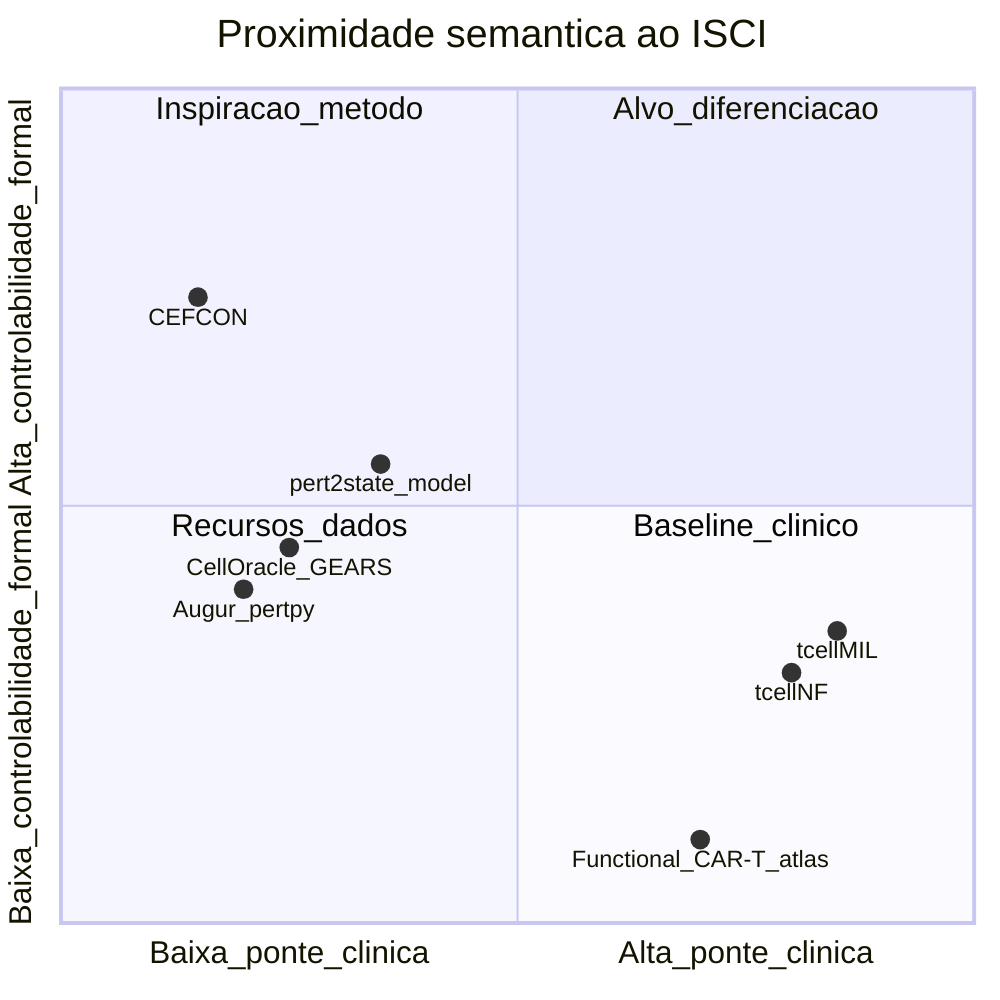
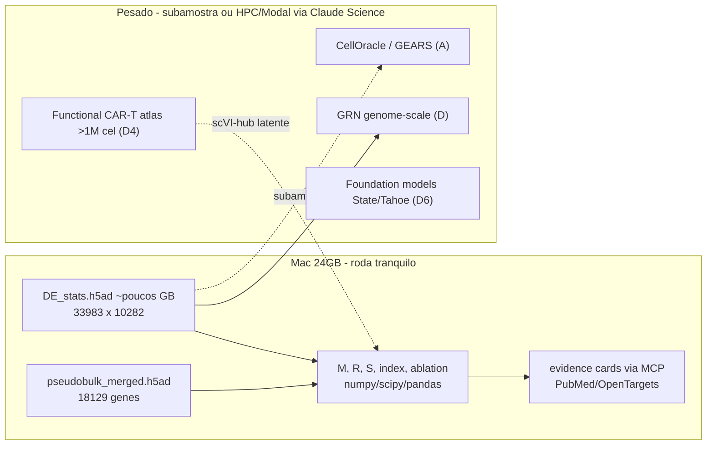
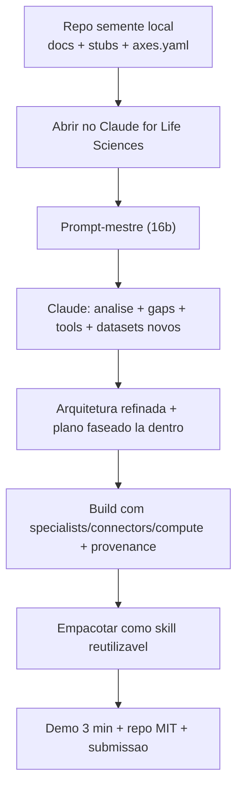

# Plano refinado — ISCI para Built with Claude: Life Sciences

## Documentos já produzidos (base do refinamento)

> **Operational plan (Jul 7):** use [`execution_plan.json`](execution_plan.json) + updated [`method.md`](method.md) / [`benchmark.md`](benchmark.md) with C1–C8 fixes. This file is the strategic archive.

- [docs/related_work.md](docs/related_work.md) — revisão expandida (§3f vizinhos semânticos, §6b matriz de mecanismos, §7b rede de ajuda, §9–11 features Claude + MCP + repos)
- [docs/method.md](docs/method.md) — especificação matemática ISCI (M, R, D, A, S)
- Plano anterior: [immune-state_controllability_ce195daa.plan.md](/Users/abelcosta/.cursor/plans/immune-state_controllability_ce195daa.plan.md)

---

## 1. Tese e posicionamento (o que estamos propondo)

**Pergunta:** Quais genes *controlam* (não apenas *associam-se a*) transições de estado em CD4+ T de forma reprodutível, estruturalmente ancorada e clinicamente projetável — para explicar resistência/sensibilidade a CAR-T e biespecíficos em hemato?

**Método:** **ISCI(g,a)** = R(g) · S(g,a) · média_geométrica(M, D, A), com null por permutação/FDR.

**Diferencial vs. o trabalho mais próximo:** O próprio lab Marson publicou `[pert2state_model](https://github.com/emdann/pert2state_model)` (MIT) — regressão linear que reconstrói assinaturas de estado como combinação de efeitos de perturbação (Fig. 4 do preprint). **ISCI não substitui isso; evolui:**


| Aspecto                 | pert2state_model                   | ISCI                                                    |
| ----------------------- | ---------------------------------- | ------------------------------------------------------- |
| Dados                   | Mesmo Perturb-seq CD4+             | Mesmo                                                   |
| Pergunta                | "Quem reconstrói esta assinatura?" | "Quem **controla** transições clinicamente relevantes?" |
| Reprodutibilidade       | Implícita                          | **R** explícito (cross-donor/guide)                     |
| Rede                    | Não                                | **D** (GRN + FVS/MDS, CEFCON-style)                     |
| Generalização           | Linear                             | **A** (CellOracle/GEARS/State)                          |
| Estabilidade do destino | Não                                | **S** (coerência geométrica/atrator)                    |
| Clínica                 | Não                                | **D4** — projeção em coortes CAR-T/TCE                  |
| Entrega                 | Pacote Python                      | Pacote + **skill Claude Science** + evidence cards      |


**Frase para juízes:** pert2state pergunta reconstrução linear; ISCI pergunta controlabilidade auditável com ponte causal→clínica.

---

## 2. Literatura — mapa completo por camada

### 2a. Clínica (resistência/sensibilidade T-redirecionada)

- **T cell fails vs tumor escapes** — Mackall SITC 2021; nosso foco é falha intrínseca do T
- **Memória/stem-like prediz resposta** — Fraietta Nature Med 2018 [CD27+ memory]; Blood 2023 stem-like CD8; **FOXO1 master regulator** Nature 2024 (TCF7 sozinho insuficiente)
- **Exaustão epigenética** — DNMT3A KO preserva stemness (Sci Transl Med 2021); TET2/DNMT3A, TOX/NR4A (reviews Molecular Therapy 2024)
- **CAR-Treg em não-respondedores** — Haradhvala Nat Med 2022 (GSE151511)
- **Biespecíficos (teclistamab)** — não-resposta = falha expansão CD8 + Tregs + exaustão, não perda de antígeno (MajesTEC-1, ResisTec NCT05945524)

### 2b. Ground-truth de controladores (benchmark positivo)

FOXO1, TCF7, TOX/TOX2, NR4A, BATF3, IKZF1, ETS1, ARID1A/cBAF, INO80 (Belk Cancer Cell 2022, PMID 35750052), RBPJ-IRF1 (Zhang Nature 2023 in vivo CRISPR screens)

### 2c. Métodos — espectro de similaridade




**Muito próximo (overlap direto):** pert2state_model, coeficientes de regulador já no suppl. Marson (Th1/Th2/activation)

**Conceitualmente próximo:** CEFCON, CellOracle, GEARS, PSGRN, perturbVI, CID, geometric coherence of perturbations (arXiv 2026 — inspira componente S)

**Clínico-complementar (não concorrente):** tcellMIL (MIL + SCENIC + in-silico TF KO em produto de infusão), tcellNF (normalizing flows), Functional CAR-T atlas (>1M células, 13 estudos, Zenodo 10.5281/zenodo.17213452)

**Gap defendível:** Ninguém uniu ISCI completo (M+R+D+A+S) + ablation + validação externa (Belk/Schmidt/Frangieh) + ponte paciente CAR-T/TCE + entrega auditável Claude Science sobre este dataset genome-scale recém-lançado.

---

## 3. Datasets — inventário por camada (públicos + opcionais hackathon)

### Camada 1 — Perturbação causal (primário)


| Dataset                         | Acesso                                                            | Uso no Mac 24GB                                                          |
| ------------------------------- | ----------------------------------------------------------------- | ------------------------------------------------------------------------ |
| **Marson CD4+ Perturb-seq**     | `s3://genome-scale-tcell-perturb-seq/marson2025_data/` (CZI, MIT) | **DE_stats.h5ad** + **pseudobulk_merged.h5ad** (~GB); evitar 22M células |
| Código oficial                  | `emdann/GWT_perturbseq_analysis_2025`                             | Entender estrutura; suppl. tables com coeficientes Th1/Th2/activation    |
| Raw (futuro)                    | SRP643211 / **GSE314342**                                         | Não necessário D0                                                        |
| **Belk 2022** exhaustion CRISPR | scPerturb/Zenodo                                                  | Validação externa (Gladstone tie-in)                                     |
| **Schmidt 2022** CRISPRa/i T    | scPerturb                                                         | Validação citocinas                                                      |
| **Frangieh Perturb-CITE**       | scPerturb                                                         | RNA+proteína                                                             |


### Camada 2 — Referência de estados T

ProjecTILs atlases, CELLxGENE/HCA, assinaturas do próprio Marson (polarization signatures no repo `4_polarization_signatures/`)

### Camada 3 — Multi-ômica (D5, opcional)

ATAC exaustão (Belk PNAS 2021), multiome, CITE-seq Frangieh; **Gladstone hackathon extras:** ChromBPNet/Corces VEP (`vep.corces.gladstone.org`) para variantes→cromatina em genes controladores

### Camada 4 — Pacientes (D4, alvo de ouro)


| Coorte                            | Acesso                               | Endpoint                                     |
| --------------------------------- | ------------------------------------ | -------------------------------------------- |
| Haradhvala Nat Med 2022           | **GSE151511**                        | LBCL CAR-T; CAR-Treg                         |
| Deng Nat Med 2020                 | GEO                                  | Produto anti-CD19                            |
| Good et al.                       | CyTOF+scRNA                          | CAR-Treg biomarker                           |
| GSE241783, 253872, 273170, 243325 | GEO                                  | Serial/product profiling                     |
| **Functional CAR-T atlas**        | Zenodo 17213452; ShinyCell; scVI-hub | Meta-validação 11 fenótipos + response/ICANS |
| teclistamab / ResisTec            | Blood abstracts; NCT05945524         | Braço biespecífico                           |
| tcellMIL training data            | Ver paper Blood 2025-5897            | Baseline comparativo D4                      |


### Camada 5 — Anotação/druggabilidade (via connectors)

Open Targets, ChEMBL, ClinicalTrials.gov, STRING/decoupler+CollecTRI

### Dados não-públicos (pós-hackathon / IDOR)

- Coortes IDOR com bulk/scRNA CAR-T ou biespecífico + desfecho → validação exclusiva se existir
- Spatial linfoma com infiltrado T → camada de nicho

---

## 4. Ferramentas e conectores — inventário completo

### 4a. Claude Science (app oficial)

Specialists: genomics, single-cell, proteomics, structural, cheminformatics | 60+ databases | provenance por artefato | fact-checker de citações | kernels Python/R persistentes | local→HPC→Modal | skills reutilizáveis | BioNeMo (Evo2, Boltz-2, OpenFold3)

**Bloqueio atual:** porta 8765 com conflito Python SimpleHTTP vs `claude-sc` — corrigir antes de executar (matar PID 27239).

### 4b. Marketplace `anthropics/life-sciences`

**MCP:** pubmed, biorxiv, consensus, wiley-scholar-gateway, open-targets, chembl, clinical-trials, synapse, 10x-genomics, owkin, cortellis, adisinsight, medidata, tooluniverse

**Skills:** single-cell-rna-qc, scvi-tools, nextflow-development, scientific-problem-selection, clinical-trial-protocol

### 4c. MCP já no Cursor (mapeamento ISCI)


| Connector            | Pipeline ISCI                                         |
| -------------------- | ----------------------------------------------------- |
| PubMed               | Grounding por gene; related_work vivo                 |
| Consensus            | Evidence cards rápidas para top candidatos            |
| bioRxiv / Wiley      | Preprints Marson, Belk, geometric coherence           |
| Open Targets         | Druggabilidade + doença (LLA/LNH/MM)                  |
| ClinicalTrials       | Contexto translacional CAR-T/TCE                      |
| Cortellis / Medidata | Stretch regulatório                                   |
| Context7             | Docs pertpy, scanpy, CellOracle durante implementação |


**Regra:** cada gene no ranking final → evidence card (ISCI score + citação rastreável + Open Targets link). Zero referências alucinadas.

### 4d. Stack Python (ambiente local, não-MCP)

`uv` + scanpy/anndata, pertpy (Mixscape/Augur/Distance), CellOracle, GEARS, decoupler+CollecTRI, pert2state_model (baseline), scvi-tools (Functional CAR-T atlas)

---

## 5. Repos open source — inspiração e uso direto


| Repo                                  | Papel                                                         |
| ------------------------------------- | ------------------------------------------------------------- |
| `emdann/pert2state_model`             | **Baseline obrigatório** — reproduzir Fig. 4 e comparar AUROC |
| `emdann/GWT_perturbseq_analysis_2025` | Mapa de dados; não copiar pipeline                            |
| `morris-lab/CellOracle`               | Componente A                                                  |
| CEFCON                                | Referência componente D                                       |
| `scverse/pertpy`                      | Validação externa + métricas                                  |
| `zinagoodlab/tcellMIL`                | Baseline clínico D4                                           |
| `ML4BM-Lab/Functional-cart-atlas`     | Validação fenótipo CAR-T                                      |
| `carmonalab/ProjecTILs`               | Eixos de estado                                               |
| Arc State / Tahoe-x1                  | D6 foundation models                                          |
| `kundajelab/chrombpnet`               | Tie-in Gladstone (opcional)                                   |


**Regra hackathon:** código integrador ISCI escrito durante o evento; repos externos citados e usados como biblioteca/baseline.

---

## 6. Rede de ajuda — quem, quando, o que perguntar

### 6a. IDOR — imunologia (seu diferencial)

**Enviar hoje:** 1-pager com esquema ISCI + tabela de eixos + top-20 genes preliminares.


| Pergunta                                                                                 | Decisão que destrava            |
| ---------------------------------------------------------------------------------------- | ------------------------------- |
| Eixos CD4+ (ativação, Th1/Th2, exaustão, memória, CD4-CTL) — falta Treg/Tfh/senescência? | `axes.py`                       |
| CD4-CTL é defensável clinicamente ou focar Th1/efetor?                                   | Narrativa demo                  |
| Top 10 controladores "reais" na prática clínica hemato?                                  | Ground-truth além da literatura |
| Coorte IDOR com desfecho CAR-T/biespecífico?                                             | D4 exclusivo pós-hackathon      |
| Spatial linfoma disponível?                                                              | Camada nicho                    |


### 6b. Discord + Anthropic

- `#office-hours` 17–18h ET (ter–sex)
- Kickoff **7/jul 12h ET** — regras + datasets Gladstone
- **Tarashansky 8/jul 12h ET** — skills/provenance subutilizados
- **Sukrit Silas 10/jul 12h ET** — alinhar com prêmio Gladstone (screening in silico)
- Perguntas: empacotar skill; limites Mac 24GB; expor provenance na submissão

### 6c. Gladstone (prêmio Impact)

Conectar ISCI → genes controladores → screening PPI in silico (Silas) + opcional ChromBPNet em enhancers de FOXO1/TOX/ARID1A

---

## 7. Arquitetura de software

```
isci/
  axes.py       # assinaturas de eixo
  movement.py   # M
  repro.py      # R
  network.py    # D (GRN + FVS/MDS)
  insilico.py   # A (CellOracle/GEARS/pert2state baseline)
  stability.py  # S
  index.py      # agregação + null/FDR
  validate.py   # ablation + coortes D4
  evidence.py   # cards via MCP connectors
config/axes.yaml
notebooks/01_isci_d0.ipynb
docs/related_work.md, docs/method.md
```

---

## 8. Escada de ambição e critérios de corte


| Degrau | Entregável                                         | Critério julgamento        |
| ------ | -------------------------------------------------- | -------------------------- |
| **D0** | M+R + baselines + ground-truth + relatório clínico | Submissão mínima viável    |
| **D1** | + D (rede)                                         | Depth                      |
| **D2** | + S + ablation                                     | Novidade metodológica      |
| **D3** | Validação Belk/Schmidt/Frangieh                    | Depth + Impact             |
| **D4** | GSE151511 ou Functional CAR-T atlas                | **Impact 25% + Gladstone** |
| **D5** | Multi-ômica                                        | Stretch                    |
| **D6** | State/Tahoe + skill Claude Science                 | Claude Use 25%             |


**Ordem de corte se atrasar:** D6 → D5 → spatial → D4 (só se D0–D2 sólidos; D4 é ouro mas D0–D2 já competem)

---

## 9. Demo 3 min (30% do score) — roteiro proposto

1. **0:00–0:30** — Problema clínico: "o T falha" em CAR-T/biespecíficos (1 slide hemato)
2. **0:30–1:00** — Pergunta + ISCI em 1 figura (M,R,D,A,S)
3. **1:00–2:00** — Claude Science ao vivo: ranking top genes + evidence card com PubMed/Open Targets
4. **2:00–2:30** — Ablation: ISCI > pert2state > DE magnitude nos controladores canônicos
5. **2:30–3:00** — Ponte clínica (se D4) ou hipótese + skill reutilizável + repo MIT

---

## 10. Cronograma (7–13 jul)

- **Ter 7/jul:** destravar Claude Science; repo MIT; 1-pager IDOR; kickoff 12h ET
- **Qua 8/jul:** dados Marson + eixos; ISCI M+R; method.md final; live Tarashansky
- **Qui 9/jul:** D (rede) + baselines + Open Targets
- **Sex 10/jul:** A + S + fusão ISCI; live Silas/Gladstone
- **Sáb 11/jul:** ablation + validação externa + D4 se viável
- **Dom 12/jul:** relatório clínico + skill + figuras + write-up
- **Seg 13/jul:** demo + submissão 21h ET

---

## 11. Riscos e mitigações


| Risco                                   | Mitigação                                                            |
| --------------------------------------- | -------------------------------------------------------------------- |
| pert2state já faz parte do story Marson | Benchmark explícito; ISCI como evolução, não reinvenção              |
| Solo + escopo grande                    | D0 fecha sozinho; cortar de cima                                     |
| Mac 24GB                                | pseudobulk/DE_stats only                                             |
| CD4-CTL controverso                     | validar com IDOR; não sobrevender                                    |
| Claude Science bloqueado                | RESOLVIDO 7/jul (porta 8765 destravada)                              |
| D4 sem tempo                            | Functional CAR-T atlas (pré-integrado) mais rápido que GSE151511 raw |


---

## 12. Matemática do ISCI, ancorada nos campos reais do dataset Marson

Confirmei a estrutura exata dos arquivos (data_sharing_readme + preprint). Isto torna cada componente do ISCI implementável sem suposições.

### 12a. O que existe em `GWCD4i.DE_stats.h5ad`

- **Formato:** AnnData `n_obs = 33.983` (perturbacao x condicao), `n_vars = 10.282` genes medidos.
- `**.obs**` (por perturbacao): `target_contrast_gene_name`, `culture_condition` (Rest/Stim8hr/Stim48hr), `ontarget_effect_size`, `ontarget_significant`, `n_downstream`, `n_total_de_genes`, `n_guides`, `guide_correlation_signif`, `guide_correlation_all`, `donor_correlation_hits_mean/min`, `donor_correlation_all_mean/min`, flags de off-target (`neighboring_gene_KD`, `distal_offtarget_flag`, `low_target_gex`).
- `**.layers**` (matriz perturbacao x gene): `log_fc` (log2FC), `zscore` (logFC/lfcSE), `p_value`, `adj_p_value`, `lfcSE`, `baseMean`.
- `**.varm**`: `measured_genes_stats_{Rest,Stim8hr,Stim48hr}`.
- **Suppl. tables prontas** (ground-truth de graca): `Th2_Th1_polarization_signature_DE_results_full.csv`, `polarization_prediction_condition_comparison_regulator_coefficients.csv` (com coluna `known_regulators` booleana e `coef_rank` 0-1), `CD4T_aging_signature_DE_results_full.csv`, colunas `bulkRNA_Th1_mean_zscore` / `bulkRNA_Th2_mean_zscore`.

### 12b. Definicao formal (cada componente -> campo concreto)

Para gene perturbado `g`, eixo `a` (vetor de assinatura `s_a` sobre os 10.282 genes), condicao `c`:

- **M — movimento direcional.** Vetor de efeito `e_{g,c}` = coluna de `.layers['zscore']` (robusto a escala; `log_fc` como sensibilidade). `M(g,a,c) = cos(e_{g,c}, s_a)` (produto interno normalizado). Sinal indica direcao (empurra para exaustao vs memoria). Rank-normalizado para [0,1] por eixo/condicao.
- **R — reprodutibilidade.** `R(g,c) = f(donor_correlation_hits_mean, guide_correlation_signif)`, penalizando `single_guide_estimate=True`, `low_target_gex=True` e `ontarget_significant=False`. Sem R, magnitude fragil vira falso controlador. Direto das colunas `.obs`.
- **D — controle estrutural.** GRN dirigida a partir dos proprios efeitos trans (`n_downstream`, matriz de z-scores significativos entre reguladores) OU decoupler+CollecTRI. Aplicar FVS/MDS (estilo CEFCON) -> gene e driver-node? Ponderar por influence score. Independente de magnitude -> captura posicao de controle.
- **A — concordancia in silico.** Rodar `pert2state_model` (baseline oficial), CellOracle e/ou GEARS; `A(g,a)` = concordancia direcao/magnitude predita vs observada ao longo de `s_a`. Camada de generalizacao/hipotese.
- **S — estabilidade do destino (diferencial original).** Coerencia geometrica do estado pos-perturbacao: dispersao/atrator dos perfis por guia e por doador (usar `by_guide.h5mu` e `by_donors.h5mu`). Controlador real -> atrator profundo e consistente; mover instavel -> suspeito. Nenhum score de driver-gene atual usa isto.

### 12c. Agregacao e significancia

```
ISCI(g,a,c) = R(g,c) * S(g,a,c) * geomean( M(g,a,c), D(g), A(g,a) )
ISCI(g,a)   = agregacao sobre condicoes (media ponderada por poder estatistico)
ISCI(g)     = agregacao sobre eixos (reportar tambem por eixo)
```

- Todos os componentes rank-normalizados [0,1]; geomean penaliza quem falha em qualquer eixo (controle verdadeiro converge).
- **Null:** permutar rotulos de perturbacao -> distribuicao nula de ISCI -> p-valor empirico + FDR (BH). So chamamos "controlador" acima de FDR.
- Degradacao graciosa: se D/A/S ausentes num degrau, geomean roda sobre os componentes disponiveis (D0 = R*geomean(M)).

---

## 13. Eixos funcionais e assinaturas (`config/axes.yaml`) — validar com IDOR

Cada eixo = conjunto de genes com direcao (+ pro-estado). Base: literatura §2b + assinaturas ja no dataset. **A revisar com imunologista IDOR** (marcado no 1-pager).


| Eixo                  | Genes-chave (+direcao)                                 | Fonte da assinatura                               | Relevancia clinica                           |
| --------------------- | ------------------------------------------------------ | ------------------------------------------------- | -------------------------------------------- |
| **Ativacao TCR**      | IL2, IL2RA, CD69, TNF, IRF4, NR4A1                     | activation regulator coefficients (dataset)       | biespecificos dependem de ativacao funcional |
| **Th1 / efetor**      | IFNG, TBX21, EOMES, STAT1, IRF1, JAK2                  | Th2_Th1 suppl. table (LFC<0=Th1)                  | citotoxicidade anti-tumoral                  |
| **Th2**               | GATA3, IL4/5/13, CCR4, STAT6, IL4R, RARA               | Th2_Th1 suppl. table (LFC>0=Th2)                  | contraste/controle negativo                  |
| **Exaustao-like**     | TOX, TOX2, PDCD1, LAG3, HAVCR2, NR4A2/3, TIGIT, ENTPD1 | curada (Belk, PNAS 2021)                          | falha de CAR-T                               |
| **Memoria/stem-like** | TCF7, LEF1, IL7R, SELL, CCR7, BACH2, ID3, KLF2, FOXO1  | curada (FOXO1 Nature 2024)                        | persistencia/resposta duravel                |
| **CD4-CTL/citotox**   | GZMB, PRF1, NKG7, GNLY, ZEB2                           | curada — **revisar defensabilidade CD4 com IDOR** | efeito direto em TCE                         |
| **Treg (controle)**   | FOXP3, IKZF2/HELIOS, IL2RA, CTLA4                      | curada (Haradhvala CAR-Treg)                      | CAR-Treg em nao-respondedores                |


Marcadores canonicos servem como ground-truth: se o ISCI ranqueia FOXO1 alto no eixo memoria e TOX alto no eixo exaustao, o metodo funciona.

---

## 14. Desenho do benchmark/ablation (a figura central que vende Depth)

**Pergunta:** o ISCI recupera controladores conhecidos melhor que baselines e cada componente agrega sinal?

- **Ground-truth positivo:** `known_regulators=True` do suppl. Marson (gratis, sem circularidade de curadoria) + set clinico curado (FOXO1, TOX/TOX2, NR4A, BATF3, IKZF1, ETS1, ARID1A, INO80). Negativos: genes de alta magnitude de DE sem evidencia de controle + genes aleatorios.
- **Metrica:** AUROC e AUPRC de recuperar os positivos; precisao@k (top-20/50).
- **Baselines a superar (ordem de dificuldade):**
  1. Magnitude de DE (`n_total_de_genes`, `|log_fc|` medio) — o straw-man
  2. Effect size / `n_downstream` — associacao bruta
  3. Centralidade de rede sozinha
  4. **pert2state_model** (regressao linear Marson) — o baseline forte/honesto
- **Ablation (curva central):** ISCI completo vs remover D, A, S um a um vs so M+R. Hipotese: cada componente move AUPRC para cima; S e D dao o salto sobre pert2state.
- **Robustez:** holdout de genes ground-truth (nao ajustar pesos neles); estabilidade cross-donor (treinar em 3 doadores, testar no 4o); estabilidade cross-condicao (Rest vs Stim).
- **Transferencia (D3):** ranking treinado no Marson recupera hits de Belk/Schmidt/Frangieh melhor que DE bruto -> controllability generaliza.

---

## 15. Viabilidade computacional (Mac M4 Pro 24GB) — o que roda onde




- **Local garantido:** todo o nucleo M/R/S/index/ablation opera sobre DE_stats (matriz densa ~33k x 10k de float = viavel em RAM com dtypes cuidadosos) e pseudobulk. Baselines e null por permutacao tambem.
- **Pesado -> Claude Science compute (local->HPC->Modal):** CellOracle/GEARS (A), GRN genome-scale (D), foundation models (D6), e o Functional CAR-T atlas (D4) — usar o **modelo scVI-hub pre-treinado** (espaco latente pronto) evita reintegrar 1M celulas.
- **Regra de ouro:** nunca carregar as 22M celulas cell-level; se precisar single-cell, subamostrar por guia/condicao.

---

## 16. Handoff para o Claude for Life Sciences (onde vamos construir)

**Decisao:** o build acontece dentro do Claude Science (todas as tools, connectors e bases estao la). Este repo local (`claude-life-science-hackatton`) serve de semente: docs de plano + esqueleto `isci/` + `config/axes.yaml`. Abrimos no Claude Science e ele assume a construcao.

### 16a. Esqueleto de repo a criar antes do handoff (semente ENXUTA)

Decisao: semente = docs + config + stubs (assinaturas+docstrings, sem logica). O Claude Science constroi a implementacao. Prompt-mestre em INGLES no repo (docs sao EN, submissao voltada a juizes).

```
claude-life-science-hackatton/
  README.md                 # tese, escada D0-D6, como rodar (EN)
  LICENSE                   # MIT
  pyproject.toml            # uv; scanpy, anndata, pertpy, decoupler, pert2state_model
  docs/related_work.md      # (feito)
  docs/method.md            # (feito) + secao 12 acima
  docs/claude_science_prompt.md  # prompt-mestre (16b) em EN
  config/axes.yaml          # secao 13
  isci/{axes,movement,repro,network,insilico,stability,index,validate,evidence}.py  # stubs: assinatura + docstring, sem logica
  notebooks/01_isci_d0.ipynb  # so cabecalho/estrutura
  data/                     # gitignored; DE_stats + pseudobulk
```

### 16b. Prompt-mestre (EN) — `docs/claude_science_prompt.md`, para colar no Claude for Life Sciences

> Objetivo: fazer o Claude analisar tudo, achar gaps/oportunidades, e coordenar o build la dentro com todas as tools/bases.

```
You are my scientific co-pilot for the "Built with Claude: Life Sciences" hackathon (Researcher Track, deadline Jul 13, 9pm ET). I am a hematologist / onco-hematologist (IDOR, Brazil). I am attaching my seed repo with two key documents: docs/related_work.md (literature review + datasets + connectors) and docs/method.md (mathematical definition of the ISCI method). Read BOTH in full before answering.

PROJECT CONTEXT
- Proposal: ISCI (Immune-State Controllability Index) — an index that separates genes that CONTROL T-cell state transitions (vs merely associated genes), combining 5 components: M (directional movement), R (reproducibility cross-donor/guide), D (structural network control / FVS-MDS), A (in-silico concordance), S (target-state stability / attractor depth — our differentiator).
- Primary dataset: Marson genome-scale Perturb-seq in primary human CD4+ T cells (CZI: s3://genome-scale-tcell-perturb-seq/marson2025_data/; code emdann/GWT_perturbseq_analysis_2025; baseline emdann/pert2state_model). I use DE_stats.h5ad (33,983 perturbation x condition, 10,282 genes; .layers zscore/log_fc; .obs donor_correlation_hits_mean, guide_correlation_signif) and pseudobulk_merged.h5ad.
- Clinical focus: immune reprogramming in hematologic malignancies — CAR-T failure/exhaustion and resistance to bispecifics / T-cell engagers.
- Compute constraint: Mac M4 Pro 24GB locally; I can use HPC/Modal through you for heavy steps.
- Judging: Impact 25%, Claude Use 25%, Depth 20%, Demo 30%; Gladstone prize = greatest potential to advance the field.

WHAT I WANT FROM YOU NOW (critical analysis, not just agreement)
1. Analyze the hackathon and objectives: given the 4 judging criteria and the Gladstone prize, where does this project win and where does it risk losing points? Be specific.
2. TOOLS inventory: list ALL tools, specialists, connectors, skills and databases you have access to here that are useful for ISCI. For each, say which pipeline stage it serves (M/R/D/A/S, external validation, clinical bridge, evidence cards). Flag tools I did NOT map in the docs.
3. Gaps and issues: critique method.md and related_work.md. Where is the ISCI math fragile, circular, or non-identifiable? Where could the benchmark leak (train/test contamination)? What would a Nature Methods reviewer attack first?
4. New datasets: beyond those I listed (Marson, Belk, Schmidt, Frangieh, Haradhvala GSE151511, Functional CAR-T atlas, ProjecTILs), are there datasets in your 60+ databases I should use for (a) defining axes, (b) external validation, (c) clinical bridge to CAR-T/bispecifics? Prioritize by 1-week feasibility.
5. Method opportunities: are there approaches/models (perturbation foundation models, GRN inference, network control) available here that would strengthen D, A or S without blowing the deadline?
6. Architecture and dev plan HERE: propose how we build inside Claude Science — order of skills to create, per-artifact provenance, what runs local vs HPC/Modal, and how to generate traceable evidence cards (claim -> citation) for each gene in the ranking. Detail the software architecture (isci/ modules) and the end-to-end data flow.
7. Phased execution plan (D0->D4) with daily checkpoints until Jul 13, making explicit what is the minimum submission (D0-D2) vs stretch.

Response format: (A) verdict on strengths/risks; (B) tool->stage table highlighting what I missed; (C) prioritized gap list with proposed fixes; (D) prioritized new datasets; (E) architecture + phased plan. Be direct, cite the files I attached, and tell me where you disagree with my plan.
```

### 16c. Como o build flui depois do prompt




