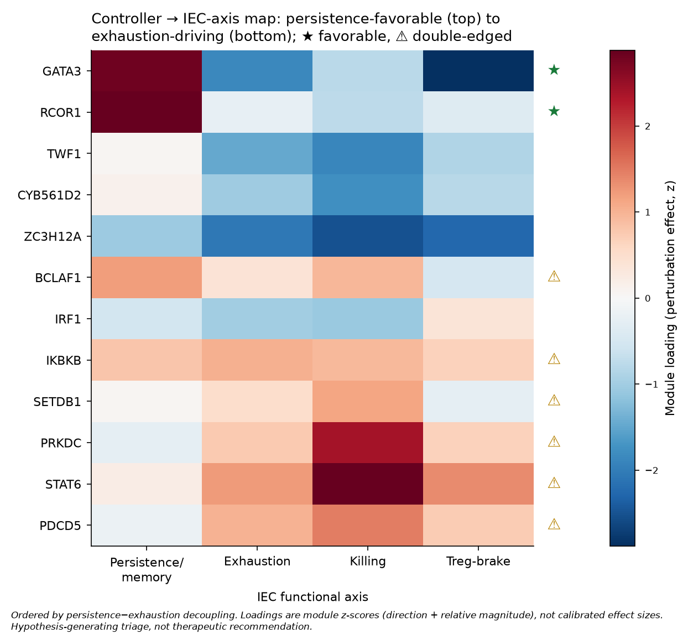

# IEC controller map — Phase 4 (controllers organize experimental biology, not clinical prediction)

**Scope.** The clinical-prediction test on IEC axes returned a well-powered null; the axes do not
transport across studies as a response biomarker. This document does **not** revisit that. It uses the
IEC axes for the job they *can* do: organizing the locked controllers into an experimentally
actionable map — which controller moves which functional axis, in which direction, at what
translational risk. Every value here is a **hypothesis-generating triage**, not a therapeutic
recommendation and not a validated causal claim.

**Inputs (all already computed, joined here — no new data).**
- Controllership rank: `results/final/isci_final_ranking.csv` (locked `ISCI_orthogonal`).
- Per-controller IEC-axis effect: `outputs/pert_module_convergence.csv` (module loadings:
  R_memory_stem = persistence/memory, NR_exhaustion = exhaustion, R_killing = killing,
  NR_Treg = Treg-brake — z-scored perturbation effects; sign = direction, magnitude = relative only).
- Intervention direction + safety board: `outputs/targetability_decision_board.csv`.

## The four questions the map answers

**1. Which controllers move persistence WITHOUT increasing exhaustion?**
`GATA3` and `RCOR1` are the clean decouplers — strongly positive on persistence/memory with
exhaustion at or below zero (persistence−exhaustion gap +4.7 and +3.2, the two largest). Both are
titratable/transient-inhibition on the safety board. These are the highest-priority *favorable*
candidates: the direction a CAR-T manufacturer wants (more stem/memory, no exhaustion cost).

**2. Which controllers increase killing but push toward exhaustion (double-edged)?**
`STAT6`, `PRKDC`, `PDCD5` — highest killing loadings but positive exhaustion (killing−exhaustion
positive, persistence−exhaustion negative). Useful as *rheostats* to study the killing/exhaustion
trade-off, dangerous as naive "boost killing" targets. `PRKDC` sits in the **dangerous** board
category, consistent with this.

**3. Which controllers DECOUPLE killing from exhaustion?**
This is the therapeutically interesting cell. `TWF1` and `CYB561D2` reduce exhaustion (negative
loading) while keeping killing off the exhaustion axis — candidate decouplers rather than pure
effector boosters. They are lower-confidence (mixed dominant axis) and belong in the probe tier, not
the front line — flagged for the wet-lab panel precisely because they *might* break the
killing↔exhaustion coupling the single-cell analysis showed is otherwise tight (ρ = −0.53).

**4. Which controllers are RNA/chromatin/NF-κB rather than TCR-activation?**
`ZC3H12A` (Regnase-1, RNA decay), `RCOR1`/`SETDB1` (chromatin), `IKBKB` (NF-κB) — these move IEC axes
without being TCR-proximal signaling nodes, so they are mechanistically distinct handles from the
TCR rheostat. `ZC3H12A` in particular is persistence-favorable and an RNA-level brake, a non-obvious
lever.

## Contrast exemplar (kept deliberately)
`IRF1` — the #1 controller — has a mixed/weak translational direction and is a **dangerous-rheostat**
on the board: high controllership does not mean favorable direction. This is the controller≠target
lesson made concrete on the IEC axes.

## Deliverable
`outputs/iec_controller_map.csv` — 12 genes × {dominant IEC axis, translational direction, four axis
loadings, persistence−exhaustion and killing−exhaustion gaps, intervention direction, board category,
druggability tier}. This is the "controller → axis → direction → risk" table; it defines an 8–12 gene
panel with clear directions and named readouts for a future CRISPRi/a titration experiment (memory:
TCF7/CCR7/SELL/IL7R; exhaustion: PD-1/TIM-3/LAG-3/TOX; killing: CD107a/granzyme B/IFNγ), **not** a
clinical intervention list.

## Honest limits
Module loadings are z-scored directions with relative — not calibrated — magnitude; the ranking is
from the CD4+ Marson anchor while the IEC axes are scored on the CAR-T atlas, so cross-system
direction should be read qualitatively; and nothing here is validated at the protein or functional
level (that is the pre-specified wet-lab and protein-CCI work). The map's value is prioritization: it
turns a flat controller list into direction-aware experimental hypotheses.
