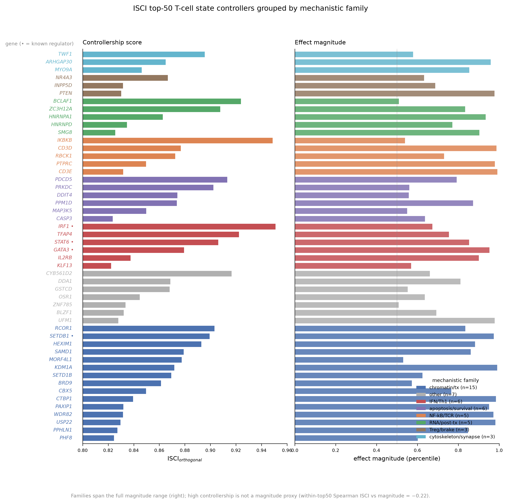

# Mechanism cards — ISCI top-50 T-cell state controllers

Six mechanistic families, annotated from Reactome/STRING/curated function (see
`outputs/controllers_annotated.csv`). Each card separates **observed perturbation
evidence** (what the Marson CD4+ data shows), **clinical-module evidence** (T-REMAP
reversal + external replication), **literature context**, **caveats**, and a
**next experiment**. Families span the full magnitude range — high controllership is
**not** a magnitude proxy (within-top-50 Spearman ISCI_orthogonal vs magnitude = −0.22).

---

## Card 1 — Chromatin / transcription state control (n=15, the largest family)

**Members (rank):** RCOR1(9), SETDB1(11,known), HEXIM1(13), SAMD1(15), MORF4L1(16),
KDM1A(21), SETD1B(22), BRD9(28), CBX5(30), CTBP1(34), PAXIP1(39), WDR82(41), USP22(44),
PPHLN1(46), PHF8(48).

- **Observed (Marson):** the dominant family among high-ISCI_orthogonal controllers, and
  it is *not* magnitude-driven — RCOR1/HEXIM1/MORF4L1 have mid-range magnitude yet high
  donor-reproducible specificity. This is the family the orthogonal signal was built to surface.
- **Clinical module (T-REMAP):** after residualizing reversal out against magnitude AND
  TCR-shutdown (`reversal_resid_tcr` in `results/module_reversal_scores.parquet`), the top
  candidates are transcription/chromatin/RNA-state factors — HNRNPM(#1, an RNA-binding
  protein), IRF2BP1(#4), MED13(#7), CXXC1(#8), TADA2B(#12) — specific reversers, not
  generic activation knobs. (The *raw*
  reversal list in `t_remap_expansion.md` is instead led by TCR-signaling genes; the
  residualization is what separates specific control from activation shutdown.)
- **Literature:** SETDB1 (H3K9me3) and KDM1A/LSD1 (CoREST, with RCOR1) enforce
  exhaustion/effector epigenetic programs; USP22 (SAGA) and BRD9 (ncBAF) are active
  immuno-oncology targets.
- **Caveat:** annotation is family-level; a chromatin gene's *direction* of state control
  is not resolved by the perturbation vector alone.
- **Next experiment:** CUT&RUN for H3K9me3/H3K4me3 after RCOR1 or KDM1A knockdown in
  CD4+ T cells, testing whether memory-stem loci open.

## Card 2 — NF-κB / TCR activation window (n=5)

**Members:** IKBKB(2), CD3D(17), RBCK1(20), PTPRC/CD45(30), CD3E(40). All novel nominations.

- **Observed:** high controllership, but this family is the one flagged for the
  **activation-axis confound** — knocking down TCR-proximal genes broadly reduces activation.
- **Clinical module:** after residualizing reversal against magnitude AND TCR-shutdown,
  **NFKB1 survives as a genuine reverser (residualized rank #11)** while the pure TCR-complex
  members drop sharply (CD3D #135, CD3E #141, and IKBKB itself falls to #644) — exactly the
  separation the confounder ledger was built to make: NF-κB transcriptional output is a real
  reverser, the TCR-proximal machinery is largely an activation artifact.
- **Literature:** the NF-κB activation window is central to CAR-T persistence vs
  exhaustion; IKK-β is druggable.
- **Caveat:** CD3D/CD3E signal is largely an activation artifact — do not read as targets.
- **Next experiment:** titratable IKBKB inhibition during CAR-T manufacturing, reading
  memory-stem fraction.

## Card 3 — IFN / Th1 controller axis (n=6)

**Members:** IRF1(1,known), TFAP4(4), STAT6(8,known), GATA3(14,known), IL2RB(35), KLF13(50).

- **Observed:** this family carries the **recovered known regulators** (IRF1/STAT6/GATA3) —
  the sanity check that the ranking finds real biology — plus novel TFAP4/KLF13.
- **Clinical module:** GATA3 is the strongest single-module reverser (reverses the Treg
  module — consistent with Th2/anti-Treg antagonism).
- **Literature:** IRF1/STAT6/GATA3 are canonical helper-lineage master TFs.
- **Caveat:** recovery of known regulators is validation, **not discovery** — these do not
  count as novel findings.
- **Next experiment:** GATA3 gain/loss in Tregs, measuring FOXP3 stability.

## Card 4 — Chromatin/RNA-state control: RNA/post-transcriptional (n=5)

**Members:** BCLAF1(3), ZC3H12A/Regnase-1(7), HNRNPA1(27), HNRNPD/AUF1(36), SMG8(47). All novel.

- **Observed:** high donor-coherent specificity; ZC3H12A is a standout novel nomination.
- **Clinical module:** HNRNPM (an RNA-binding protein, not itself in the top-50 controllers
  but a T-REMAP reversal candidate) tops the fully-residualized reversal list (`reversal_resid_tcr` #1)
  — RNA-binding control of state is a genuinely non-obvious hit, echoing this family's theme.
- **Literature:** Regnase-1 (ZC3H12A) is a validated brake on T-cell effector mRNAs and a
  hot CAR-T engineering target (its deletion boosts persistence).
- **Caveat:** RNA-level control is inferred from steady-state effect vectors, not from
  direct decay measurement.
- **Next experiment:** RIP-seq / actinomycin-D decay assay after ZC3H12A knockdown.

## Card 5 — Migration / synapse / killing + cytoskeleton (n=3 cytoskeleton + sensitivity modules)

**Members (cytoskeleton):** TWF1(12), ARHGAP30(26), MYO9A(32). Plus the R_migration/R_killing
sensitivity modules.

- **Observed:** the R_migration and R_killing modules pass the movability gate (86–88%).
- **Clinical module + EXTERNAL:** the **sensitivity axis (memory-stem / migration / killing)
  replicates direction in the independent CAR-T cohort GSE208052** (3/3 higher in responders;
  R_memory_stem p=0.032, one-sided, n=9). This is the strongest external-validation signal.
- **Literature:** actin-cytoskeleton/synapse quality is an established correlate of CAR-T
  killing efficiency.
- **Caveat:** n=9 direction replication, uncorrected; not a validation.
- **Next experiment:** live-imaging synapse formation after ARHGAP30/TWF1 modulation.

## Card 6 — Treg / suppressive brake + apoptosis/survival (n=3 Treg + n=6 apoptosis)

**Members (Treg/brake):** NR4A3(25,clinical), INPP5D/SHIP1(41), PTEN(43).
**(apoptosis/survival):** PDCD5(6), PRKDC(10), DDIT4(18), PPM1D(19), MAP3K5(29), CASP3(49).

- **Observed:** NR4A3 is the one flagged clinical controller (NR4A exhaustion TF); the
  apoptosis family is coherent but mid-magnitude.
- **Clinical module + EXTERNAL:** the **resistance axis (Treg / exhaustion / toxicity) did
  NOT replicate** in GSE208052 (0/3) — an honest negative. In the infusion-*product*
  compartment, Treg/exhaustion signal does not track 3-month resistance; the atlas Treg
  finding was itself only p=0.04.
- **Literature:** NR4A/TOX drive CAR-T exhaustion; PTEN/SHIP1 are PI3K brakes.
- **Caveat:** the resistance modules are the weakest link — direction is
  cohort/compartment-dependent, stated openly.
- **Next experiment:** measure these modules in post-infusion / tumor-infiltrating CAR-T
  (not infusion product), where the resistance program should be visible.

---

**Honesty summary.** Recovered known regulators (IRF1/STAT6/GATA3/SETDB1) validate the
method; novel nominations concentrate in chromatin/transcription and RNA control; the
sensitivity axis replicates externally while the resistance axis does not. No clinical
prediction is claimed.
