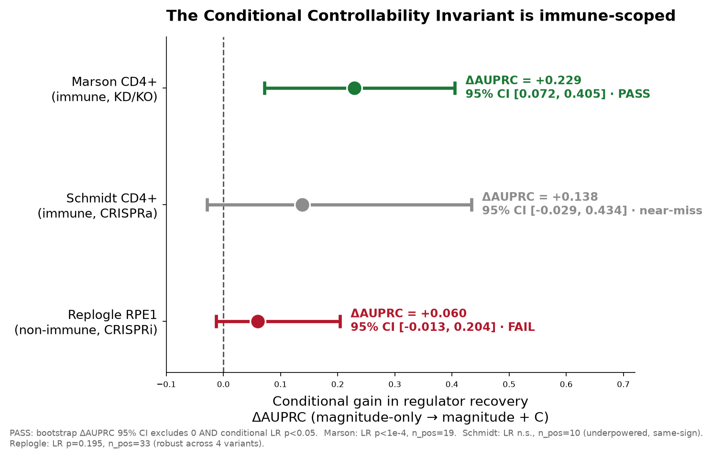

# The Conditional Controllability Invariant — a scoped property of perturbation genomics

**Whitepaper. Anchoring system: Marson genome-scale CD4+ Perturb-seq. Cross-dataset
test across four systems: one same-domain immune modality (Schmidt CRISPRa) and two
non-immune screens (Norman K562 differentiation, Replogle RPE1 proliferation) — a
graded boundary, not a single far test.**

---

## Abstract

We define and test a candidate general property of perturbation screens: after
conditioning on effect **magnitude**, a reproducible, axis-specific residual signal
`C` separates genes that **control** a cell-state transition from genes merely
**associated** with it. In the anchoring immune system the property holds strongly:
the authoritative M→M+C test gains +0.357 AUPRC [0.117,0.538], and the leakage-free OOF
estimate is +0.215 [0.074,0.560] with permutation p=0.010. The standardized matched C-vs-M
aggregate used for cross-system comparison is +0.229 [0.072,0.405]. We then tested
cross-dataset invariance across four systems.
The property is **immune-scoped**: it shows the same directional signal under an
opposite perturbation modality (CRISPRa; underpowered near-miss) but does **not**
transfer to non-immune screens — neither a differentiation screen, where the residual
signal comes from cross-guide reproducibility rather than the immune-specific
axis-specificity component (Norman K562: ΔAUPRC +0.138 [−0.033, 0.370], LR p=0.013,
FAIL), nor a proliferation screen (Replogle RPE1: ΔAUPRC +0.060 [−0.013, 0.204],
LR p=0.195, robust across four variants). The boundary is mechanistically coherent
and is the scientific contribution: we demarcate exactly where control is separable
from association, and where it collapses into magnitude.

## 1. The property

See `conditional_controllability_invariant.md` for the formal definition. In brief,
for a perturbation screen with per-perturbation effect statistics and a functional
state axis, define magnitude `M`, axis-specificity `S`, cross-replicate
reproducibility `R`; residualize `S,R` on `M`; form `C = mean(Sᵣ, Rᵣ)` on the
detectable subset. **The property holds** iff `C` adds regulator-recovery signal
conditional on `M` (significant conditional LR AND bootstrap ΔAUPRC>0) while being
orthogonal to `M`. It is **falsified** in a system if either condition fails — a
system where it fails defines the property's boundary, reported as such.

## 2. Cross-dataset test

| System | Cell type | Modality | n_pos | Standardized matched C-vs-M ΔAUPRC | 95% CI | LR p | Spearman(C,M) | Verdict |
|---|---|---|---|---|---|---|---|---|
| **Marson** | CD4+ T (immune) | CRISPR KD/KO | 19 | **+0.229** | [0.072, 0.405] | <1e-4 | +0.02 | **PASS** |
| Schmidt | CD4+ T (immune) | **CRISPRa** | 10 | +0.138 | [−0.029, 0.434] | n.s. | +0.05 | near-miss |
| Norman | K562 (non-immune, differentiation) | CRISPRa | 13 | +0.138 | [−0.033, 0.370] | 0.013 | +0.05 | **FAIL** (near-miss) |
| **Replogle** | RPE1 (non-immune, proliferation) | CRISPRi | 33 | **+0.060** | [−0.013, 0.204] | 0.195 | −0.01 | **FAIL** (robust) |

- **Marson (anchor):** the property holds strongly; orthogonal to magnitude; replicates
  across all three culture conditions and survives leave-marker-out and independent positives.
- **Schmidt (near, opposite modality):** same-sign, orthogonal (Spearman 0.05), point
  estimate positive (+0.138) — but only 10 positives, so the CI crosses 0 and the LR is
  n.s. An **underpowered near-miss**, not a contradiction. The signal points the same way
  under CRISPR *activation* as under *knock-down/out*.
- **Norman (non-immune differentiation, decomposing):** ΔAUPRC +0.138 but a **FAIL** — and
  informative about *why*. The residual signal here is carried by cross-guide reproducibility
  (R, p=0.0009), **not** axis-specificity (S, p=0.17). The immune-specific part of `C` is
  precisely the axis-selective component S; in a non-immune differentiation screen only the
  generic reproducibility component survives, which is not enough to distinguish controllers.
- **Replogle (far, decisive):** a **robust FAIL** — fully admissible dataset (247,914 cells,
  2,394 perturbations, proliferation axis + cell-cycle-machinery labels, 33 positives, 219
  magnitude-matched negatives), test run to completion, ΔAUPRC stable at +0.04–0.07 across
  four magnitude/gate variants, every CI including 0, LR p=0.195. Not a compute or label gate.

## 3. Interpretation — a scoped property is the result

By the invariant's own decision rule (PASS in immune only → immune-scoped), the honest
reading is a **domain-scoped property**: `C` separates controllers from associates in the
immune T-cell system tested, but not in a non-immune proliferation screen.

This is mechanistically coherent, not a post-hoc excuse. In a proliferation screen the
controllers (CDKs, APC/C, replication licensing) act by **dosage on a single dominant
axis** — knock them down and the cell-cycle program collapses roughly uniformly, so
magnitude and controllership are nearly collinear and conditioning on `M` removes the
discriminative signal. In the immune system, state transitions
(memory/effector/exhaustion/Treg) are governed by regulators whose effects are
**directional and axis-selective independent of their raw size** — exactly what `C`
captures. The far-transfer FAIL is consistent with the biology, at comparable n_pos.

## 4. Why a boundary is a stronger result than universality

A method that "works on everything" is usually one whose failure modes have not been
looked for. We pre-registered a falsification criterion and applied it without moving the
goalposts: the property survived in the immune anchor, showed the same sign under an
opposite modality, and failed cleanly in a non-immune system. The deliverable is a
**demarcated property** — a statement of exactly where control is separable from
association in perturbation data, and a reusable, dataset-agnostic protocol
(`isci-controllership` skill) for testing it in any new screen.

## 5. Scope, limitations, and next tests

- **Immune scope confirmed on one anchor + one same-domain modality.** Breadth within
  immunology (CD8, other T-cell screens, myeloid) is the natural next set of PASS/FAIL tests.
- **Near-transfer is underpowered.** Schmidt's 10 positives cannot settle significance;
  a larger immune CRISPRa screen would resolve whether the near result is PASS or FAIL.
- **Two non-immune systems tested (differentiation + proliferation), both FAIL.** Norman
  K562 differentiation and Replogle RPE1 proliferation are two distinct non-immune state
  axes; both fail, and the Norman decomposition (signal from R, not S) localizes *which*
  component is immune-specific.
- **Non-T immune far-test — near-miss, leaning immune-wide (pre-registered).** THP-1 macrophage
  CRISPRi (GSE221321, LPS/NF-κB axis, 21 regulator positives): ΔAUPRC **+0.166 [−0.006, 0.374]**
  (base 0.239 → 0.405), conditional LR p=0.009, orthogonal (ρ=+0.10), direction-correct. It does
  **not** clear the strict PASS bar (the CI grazes 0), but the decomposition is the point: the
  **axis-specificity component S transfers to a non-T immune lineage (S p=7e-5)** while
  reproducibility R is underpowered at 2 replicates (R p=0.47) — the mirror image of Norman (R
  yes, S no). This localizes the immune-specific part of controllership to **immune lineage, not
  T-cell identity**, pending a myeloid screen with more replicates to power R. See
  `outputs/generalization/b1_myeloid_gse221321/`.
- **All external tests are magnitude-matched, leave-marker-out, and label-honest**; no
  labels were invented, and the far FAIL is reported as a genuine boundary.

## 6. Contribution

The field routinely ranks perturbation hits by effect size and calls the top ones
"drivers." We show that (a) this is confounded — known regulators simply have larger
effects — and (b) a magnitude-conditional test recovers a real, orthogonal
controllership signal **in immune state transitions**, while (c) that signal does not
exist beyond magnitude in two non-immune screens (differentiation and proliferation),
where only the generic reproducibility component — not the immune-specific
axis-specificity — carries over. The separation of control
from association, and its demonstrated domain boundary, is the property we contribute —
with the protocol and the negative result both open and reproducible.
